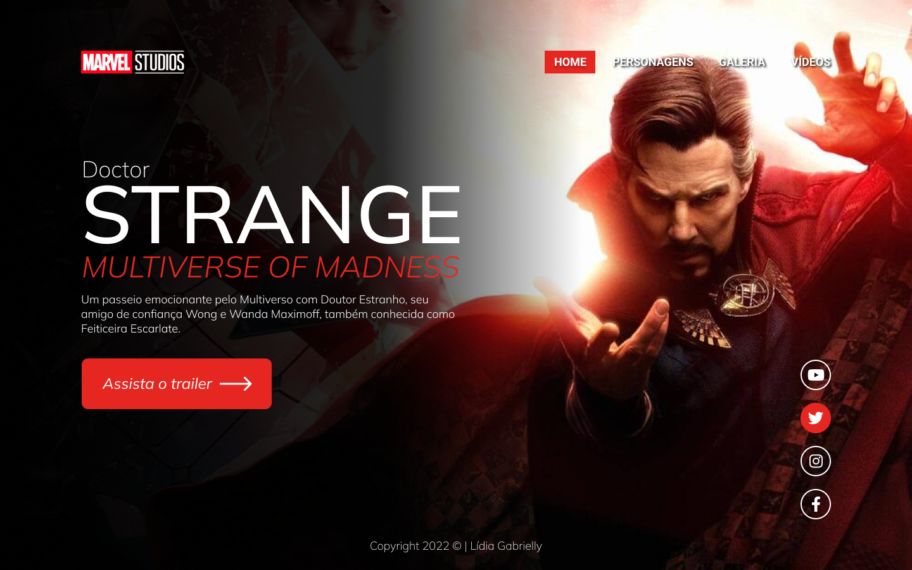
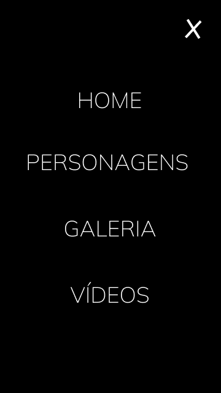

# DOCTOR STRANGE

## Multiverse Of Madness

Projeto construido durante as aulas de LIMA, no [SENAI de Jandira](https://jandira.sp.senai.br/) no curso de desenvolvimento de sistemas, com orientação do professor [Fernando Leonid](https://github.com/fernandoleonid)

---

## Qual era o objetivo do projeto?
O objetivo era criar uma landing page com base no design feito no figma, aprendendo a estrutura do HTML, CSS, JavaScript e conceitos de responsividade.

---

## O que é Landing Page?
Landing Page são páginas onde o foco principal é a conversão de visitantes, assim, essas páginas possuem uma estetica mais minimalista comparada com os sites tradicionais.

---

## Tecnologias usadas
- HTML 5
- CSS 3
- JavaScript
- Figma

---

## Links
- [Resultado do site](https://lidiagaldino.github.io/doctor-strange/)
- [Design no Figma](https://www.figma.com/file/NlcuQ4F9nrJ6PdR8eVLZ23/DR.-ESTRANHO?node-id=10%3A27)
- [Código](https://github.com/lidiagaldino/doctor-strange)

---

## Autor
[Lídia Galdino](https://github.com/lidiagaldino)